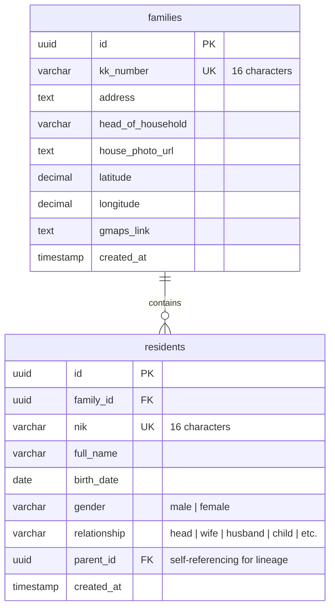

<h1 align="center">
  <br>
  
  <br>
  <b>SIPEN-GO</b>
  <br>
  <sub>Sistem Informasi Penduduk Gombang</sub>
</h1>

<p align="center">
  <a href="https://flutter.dev"></a>
  <a href="https://dart.dev"></a>
  <a href="https://supabase.com"></a>
  <a href="https://pub.dev/packages/flutter_riverpod"></a>
  
</p>

<p align="center">
  <b>SIPEN-GO</b> is a robust, production-grade census and population management application tailored for the village of Gombang. It empowers village administrators to digitally record, manage, and analyze demographic data. The application features family lineage visualization, secure photo uploads, geolocation integration, and offline-first local database caching.
</p>

---

## 🚀 Key Features

SIPEN-GO modernizes village administration through a suite of advanced features:

*   🔐 **Secure Authentication** — Single-user access control for village officials using Supabase Go-based Auth.
*   👨‍👩‍👧‍👦 **Family Registry (Kartu Keluarga)** — Seamless management (CRUD) of family units and address metadata.
*   👤 **Resident Management** — Profile indexing for individual residents, tracking demographic attributes, birth dates, and familial roles.
*   🌳 **Visual Lineage Tree** — Interactive, hierarchically rendered family tree mapping parents and children.
*   📸 **Cloud Photo Storage** — Built-in camera integration with image compression and secure uploads to Supabase Storage.
*   🗺️ **Google Maps Integration** — Coordinate capture and maps linking to pinpoint family residences.
*   📊 **Analytics Dashboard** — Visualized statistics detailing population size, gender distribution, and verification progress.
*   📤 **Multi-format Exports** — Generate professional reports instantly in **PDF** or **Excel (.xlsx)** formats.
*   ⚡ **Offline Cache (Hive)** — Seamless caching mechanism enabling quick access and fast load times.

---

## 🛠️ Tech Stack & Architecture

### Technology Stack
*   **Frontend SDK**: [Flutter](https://flutter.dev) (v3.7.2+) & [Dart](https://dart.dev) (v3.7.2+)
*   **State Management**: [Riverpod](https://riverpod.dev) (v2.6.1+)
*   **Backend Database**: [Supabase](https://supabase.com) (PostgreSQL)
*   **Local Caching**: [Hive](https://pub.dev/packages/hive) (Key-value local database)
*   **Reporting & Storage**: [pdf](https://pub.dev/packages/pdf), [excel](https://pub.dev/packages/excel), Supabase Storage

### Architecture Principle
SIPEN-GO is structured using **Clean Architecture** patterns separated into distinct layers to guarantee testability and maintainability:

```text
lib/
├── core/             # Global configurations, design systems, themes, and helper utilities
│   ├── config/       # Environment variables binding
│   ├── constants/    # Static assets, strings, and colors definition
│   └── theme/        # Material Design 3 app themes
├── data/             # Models (DTOs), Repository Implementations, and Service layers
│   ├── models/       # Data transfer objects with JSON converters
│   ├── repositories/ # Abstract repository implementations
│   └── services/     # API connectors, Cloud Storage, and Document Exporters
├── domain/           # Business entities and core enums
└── presentation/     # UI Layer: Screens, custom widgets, and Riverpod providers
```

For a comprehensive guide, please refer to the [ARCHITECTURE.md](ARCHITECTURE.md) and [PROJECT_STRUCTURE.md](PROJECT_STRUCTURE.md) files.

---

## 💻 Local Development Setup

Follow these steps to establish a local development environment.

### Prerequisites
*   **Flutter SDK** (v3.7.2 or higher)
*   **Dart SDK** (v3.7.2 or higher)
*   **Git**
*   A **Supabase** account

### 1. Clone the Project
```bash
git clone https://github.com/azcharia/sipen-go.git
cd sipen-go
```

### 2. Configure the Supabase Backend
1. Create a new project on your [Supabase Dashboard](https://supabase.com).
2. Go to the **SQL Editor** in Supabase and run the SQL instructions located in [supabase_setup.sql](supabase_setup.sql) to initialize your database schema, RLS policies, triggers, and indices.
3. Run the SQL script in [supabase_migration_gmaps.sql](supabase_migration_gmaps.sql) to update the table structure with Google Maps integration.
4. Go to **Storage** and create a public bucket named `house-photos` for storing house photography.

### 3. Setup Environment Variables
Create a `.env` file in the project root by copying the template file:
```bash
cp .env.example .env
```
Open `.env` and fill in your Supabase credentials:
```env
SUPABASE_URL=https://your-project-id.supabase.co
SUPABASE_ANON_KEY=your-anon-key-here
```
> [!IMPORTANT]
> The `.env` file is excluded from Git tracking via `.gitignore` to prevent leaking private credentials.

### 4. Build and Run
Retrieve dependencies, generate assets, and start the development server using the environment variables file:

```bash
# Get Dart dependencies
flutter pub get

# Generate launcher icons
flutter pub run flutter_launcher_icons

# Run the app specifying the environment configuration file
flutter run --dart-define-from-file=.env
```

---

## 🗄️ Database Design

SIPEN-GO uses a PostgreSQL database schema managed by Supabase. Here is a brief representation of the core schema:



*   **Row-Level Security (RLS)** is enabled on all tables. Only authenticated village administrators have permissions to insert, read, or modify database entries.
*   **Cascading Deletes** are configured on the `residents` table to cleanly remove all members if a family card is deleted.

---

## 🤝 Contribution Guidelines

This repository is maintained for the Gombang village administration. If you are developing new features:
1. Create a new branch: `feature/your-feature-name` or `bugfix/your-bugfix-name`.
2. Follow standard Dart formatting (`dart format .`).
3. Ensure the project is free of lint warnings by running `flutter analyze`.
4. Consult the [CONTRIBUTING.md](CONTRIBUTING.md) for pull request workflows.

---

## 📝 License

**Proprietary Software**  
All rights reserved by the Gombang Village Administration. Any unauthorized copying, distribution, or modifications of this software is strictly prohibited.

---
<p align="center">Made with ❤️ for Desa Gombang</p>
